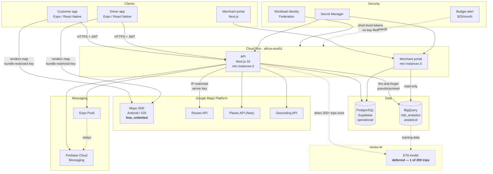

# GCP architecture

**Status: written, not applied. No GCP project has been created and no resource has been
provisioned.** The application code degrades cleanly without any of it — see
[What works without GCP](#what-works-without-gcp).

## Overview

## Why each service

| Service | Role | Cost |
|---|---|---|
| **Maps Platform** | Routing, geocoding, autocomplete, map rendering | $0 at current volume |
| **FCM** | Push, alongside Expo's transport | Free, no meaningful limits |
| **BigQuery** | Trip/order analytics, ETA model training data | Free tier |
| **Cloud Run** | Serverless container hosting, scales to zero | $0 idle |
| **Vertex AI** | ETA prediction — **deferred** | $0 until deployed |

## Security posture

**Two Maps keys, not one.** The Maps SDK render key ships inside the app binaries — unavoidable,
and harmless, because that SKU is free at unlimited volume. Geocoding, Routes and Places bill per
request, so they use a server-only key restricted by IP and by API, reached through authenticated,
rate-limited proxy routes. A bundle-ID restriction would not protect a billable key: the restriction
is asserted by the caller and the key is extractable from any APK.

**No service-account keys exist.** GitHub Actions authenticates through Workload Identity
Federation, exchanging a short-lived GitHub OIDC token for a short-lived GCP token. The provider is
constrained to this repository by `attribute_condition` — without that line, any workflow in any
public repository could present a valid token from the same issuer. Cloud Run uses its attached
service account, so no key exists there either.

**Secrets never pass through Terraform.** Terraform creates the secret containers and grants access;
values are added out of band with `gcloud`. A value supplied as a Terraform variable is written to
state in plaintext, and state is a far softer target than Secret Manager.

**Least privilege, per resource.** The API can write to one BigQuery dataset and read five named
secrets — not `bigquery.admin`, not `secretmanager.admin`. The portal is read-only on BigQuery and
is deliberately **not** granted the analytics salt: the service that can read pseudonymised ids does
not get the means to reverse them. The deployer's `serviceAccountUser` role is granted on two named
accounts rather than project-wide, which would be a privilege-escalation path out of CI.

**Identifiers are pseudonymised before leaving the operational database.** Salted SHA-256, and
`NULL` when no salt is configured rather than an unsalted hash — over a known id space that would be
reversible and a false assurance of anonymity.

## Cost-scaling narrative

Infrastructure cost is designed to scale with usage, and today usage is near zero:

- **Maps Platform and FCM stay within free tiers at current volume.** Map rendering and
  session-token autocomplete are free at *any* volume; only geocode, route and matrix calls consume
  quota, at roughly 5 billable events per completed ride against 10,000 free per SKU per month —
  about **2,000 rides/month free**. Past that, ~$0.025 per ride against a R25 minimum fare.
- **BigQuery** sits inside 1 TiB of query processing and 10 GiB of storage per month. Tables are
  partitioned by day with `require_partition_filter`, so an unbounded scan is rejected rather than
  billed.
- **Cloud Run** costs nothing while idle at `min_instances = 0`. Cost begins with real requests and
  scales with them.
- **Vertex AI** is the one component with genuine ongoing cost, which is precisely why it is
  deferred until the trip volume justifies it.

Costs grow deliberately alongside real trip volume and revenue as the platform expands to additional
townships — not ahead of it. The $25 budget alert is sized to catch a leaked key or a retry loop,
not to accommodate growth; raise it when revenue justifies real spend.

## What works without GCP

Everything except the features that inherently need it:

| Without GCP | Behaviour |
|---|---|
| No `GOOGLE_MAPS_SERVER_KEY` | `/api/maps/*` returns 503. Auth, rides, orders unaffected. |
| No `FIREBASE_SERVICE_ACCOUNT_JSON` | FCM transport disables itself; Expo Push handles everything. |
| No `BIGQUERY_DATASET` | Analytics writes are no-ops; the dashboard says "not configured". |
| Not on Cloud Run | Runs anywhere Next.js runs. |
| No Vertex endpoint | Maps ETA is used — as it is today. |

This is deliberate. A portfolio project that only runs against a live cloud account is a project
nobody can review.

## Bringing it up

See [`infra/gcp/README.md`](../infra/gcp/README.md) for the ordered steps. Each cost-incurring step
requires explicit approval before it is run.
